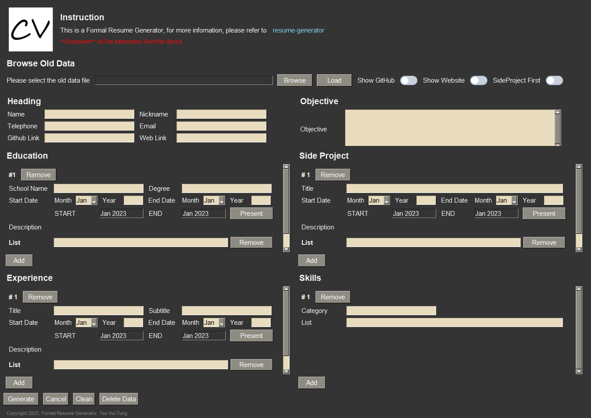
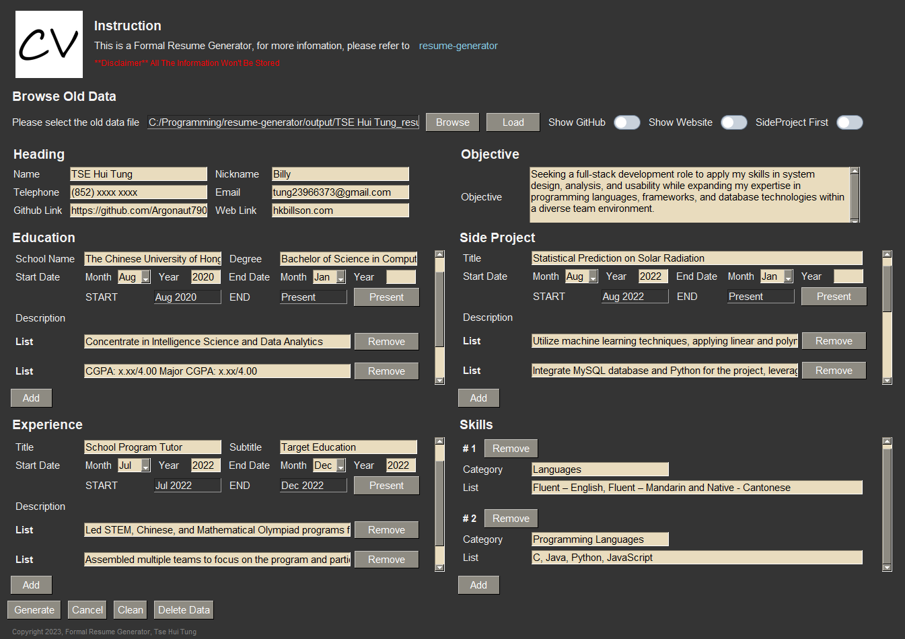
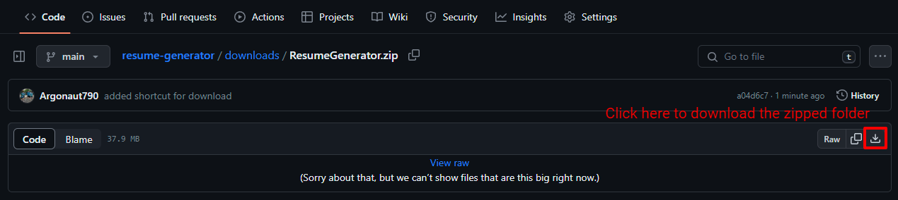
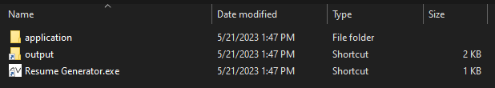
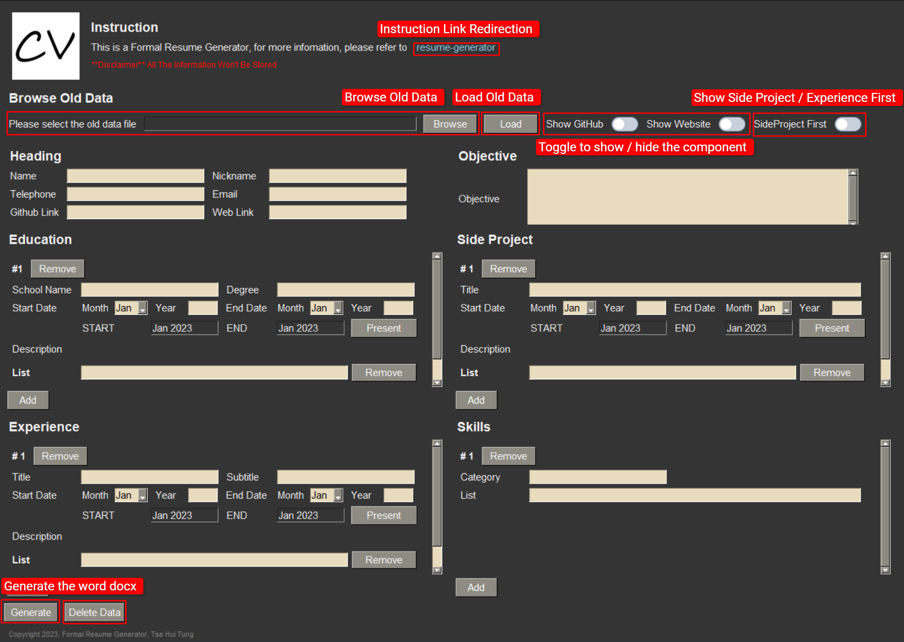
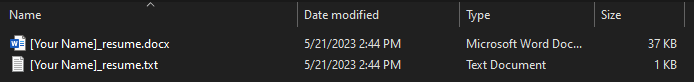
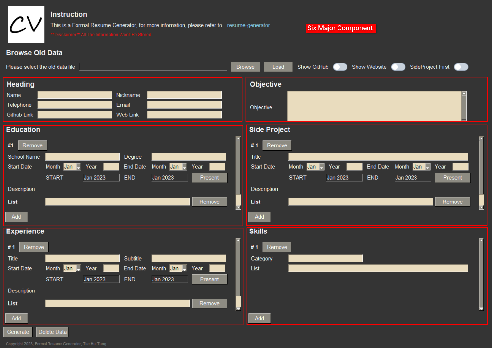
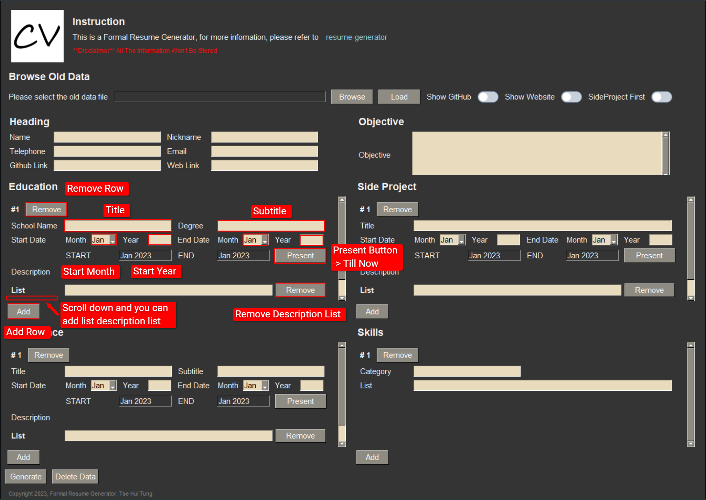

<p align="center">
  
</p>
  
## 🔥 Formal Resume Generator
This Formal Resume Generator is aim to generate a common layout but formal resume, since a lot of online template are too fancy and charging for some templates, therefore i built my own. 🙂

# Navigation

* [Disclaimer](#disclaimer)
* [Template & Samples](#template)
* [Graphical User Interface](#gui)
* [Features](#features)
* [Download](#download)
* [How to Write Better Resume](#better_resume)
* [GUI Instruction](#instruction)
* [What to write in each Components?](#write_in_component)
* [Upcoming Features](#upcoming_features)
* [Requirements](#requirement)
* [Run Locally](#run_locally)
* [Tech](#tech)
* [References](#reference)
* [License](#license)
* [Feedback](#feedback)

<a name='disclaimer'></a>
## ‼️ Disclaimer

*All the data will be stored locally only\
`NO DATA WILL PASS TO ANYBODY ELSE`

<a name='template'></a>
## 📃Template & Samples
<pre>Template:                                                         Sample:</pre>
<div align="center">
  
  
</div>

<a name='gui'></a>
## ⚙️Graphical User Interface
<pre>GUI:</pre>
<div align="center">
  
</div>
<pre>Example:</pre>
<div align="center">
  
</div>

<a name='features'></a>
## ✨Features

- Definitely Formal, no fancy stuff, just black and write
- You are able to do further adjustment un the generated word docx
- Flexible layout design
- Tips on how to write better resume
- Browse old data
- Data privacy concerned
- Easy to Use
- Free, no charge

<a name='download'></a>
## ⬇️Download
<p>1. Click here to download: </p>

[Formal Resume Generator](./downloads/ResumeGenerator.zip)

<div align="center">
  
</div>
<p>2. Unzip the folder</p>
<p>3. Inside the folder, it will contain two shortcut 1) Resume Generator.exe 2) output folder</p>
<div align="center">
  
</div>

### <ins>Resume Generator.exe</ins>
- Click the application to start the generator
### <ins>output folder</ins>
- Everytime it generates, it will save two files, one is .txt, another one is .doxc which is the word document.
- The .txt file is for browse old data usage.

<a name='better_resume'></a>
## How to Write Better Resume
pass

<a name='instruction'></a>
## GUI Instruction
### How to use the GUI
- You can checkout this github link by clikcing "resume-generator" to see the instruction/guideline.
- Top left hand side you can browse the old generated .txt file and load the old data.
- Top right hand side you can toggle to show/hide the components, also you are able to pick whether to show side project/experience first.
<div align="center">
  
</div>

- After you clicked the "Generate" button, the generator will output 2 files including the word and .txt documents. The .txt file is for load old data purpose. *Ensure that you close the docx before you generate it
- "[Your Name]" will be replaced with what you filled in, if you didn't fill in, it will be the default value.
<div align="center">
  
</div>

- Inside the generator, there include 6 major components, it's fine if u didn't fill in, it still can generate it.
- It's flexible for you to fill in.
<div align="center">
  
</div>

- For those components except Heading and Objective, you can add the row field and description list field as well as the remove.
- The duration you can select the month and input the yaer, if the component is still running till now, you can press the "Present" button, the shadowed field is for your preview. 
<div align="center">
  
</div>

<a name='write_in_component'></a>
## What to write in each Components
### Heading

### Objective

### Education

### Side Project

### Experience

### Skills

<a name='upcoming_features'></a>
## 👨🏻‍💻Upcoming Features
- ✨More templates

<a name='requirement'></a>
## Requirement

- python 3.9 or above
- pip 23.1.2

<a name='run_locally'></a>
## Run Locally
1. Clone the project to your repository
```sh
git clone https://github.com/Argonaut790/resume-generator.git
```
2. Change to project directory
```sh
cd .\resume-generator
```
3. Install package and dependencies
```sh
pip install -r requirements.txt
```
4. Execute the resume.py
```sh
python resume.py
```

<a name='tech'></a>
## Tech
- Used PySimpleGUI as the GUI for input
- Used python-docx to generate the word document

<a name='reference'></a>
## Useful Reference Link
- Scroll Bar Update in GUI\
https://stackoverflow.com/questions/65811804/how-to-automatically-update-the-pysimplegui-column-scroll-bar
- Dynamic Column in GUI\
https://github.com/amithr/PySimpleGUI-Dynamically-Add-Elements/blob/main/main.py

<a name='license'></a>
## License

[MIT license](./LICENSE)

<a name='feedback'></a>
## Feedback

if you found any bugs or any advices, please feel free to contact me via tung23966373@gmail.com
with title [resume-generator] ...
