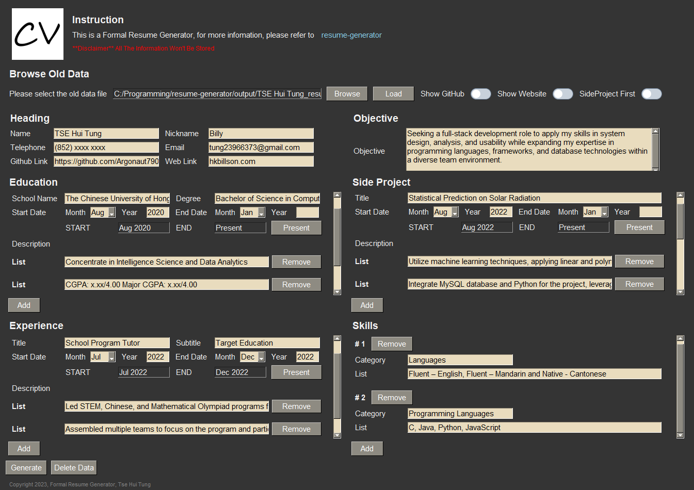

<p align="center">  
  
</p> 

## 🔥 Formal Resume Generator
This Formal Resume Generator aims to generate a common but formal resume. Since a lot of online templates are too fancy and charge for some templates, therefore I built my own. 🙂

# Navigation
* [Disclaimer](#disclaimer)
* [Template & Samples](#template)
* [Graphical User Interface](#gui)
* [Features](#features)
* [Download](#download)
* [How to Write Better Resume](#better_resume)
* [GUI Instruction](#instruction)
* [Upcoming Features](#upcoming_features)
* [Requirements](#requirement)
* [Run Locally](#run_locally)
* [Tech](#tech)
* [References](#reference)
* [License](#license)
* [Feedback](#feedback)

<a name='disclaimer'></a>
## ‼️ Disclaimer
*All the data will be stored locally only

`NO DATA WILL PASS TO ANYBODY ELSE`

<a name='template'></a>
## 📃Template & Samples
<pre>Template:                                                         Sample:</pre>
<div align="center">  
    
  
</div>

<a name='gui'></a>
## ⚙️Graphical User Interface

<pre>GUI:</pre>
<div align="center">  
  
</div>

<pre>Example:</pre>
<div align="center">  
  
</div>

<a name='features'></a>
## ✨Features
- Definitely Formal, no fancy stuff, just black and white.
- You are able to make further adjustments in the generated Word document.
- Flexible layout design
- Tips on how to write a better resume
- Browse old data
- Data privacy concerns
- Easy to use
- Free, no charge

<a name='download'></a>
## ⬇️Download
<p>1. Click here to download: </p>

[Formal Resume Generator](./downloads/ResumeGenerator.zip)
<div align="center">  
  
</div>
<p>2. Unzip the folder</p>
<p>3. Inside the folder, it will contain two shortcuts. 1) Resume Generator.exe 2) output folder</p>
<div align="center">  
  
</div>

### <ins>Resume Generator.exe</ins>
- Click the application to start the generator.
### <ins>output folder</ins>
- Everytime it generates, it will save two files, one is .txt, another one is .doxc which is the word document.
- The .txt file is for browsing old data usage.

<a name='better_resume'></a>
## How to Write a Better Resume
You have to understand that HR will only look at your resume for 7 seconds in a large company, therefore you have to put the brightest, most concise, and most correlated content into your resume.
### Point 1: 
Write your objective in about 2 lines, write something that you are purchasing, it's not necessary to be tailor-made, you can write it in general.
### Point 2: 
Show your college gpa if it is good to look at, like above 3.00.
### Point 3: 
Decide to show your side project or experience first, the centered content will be the first impression, if you have an impression experience profile, then I would suggest you show it first, remember only 7 seconds.
### Point 4: 
For the experience component, decide to show the position title or the company name as the main title, it is always better for you to show something that impresses.
### Point 5: 
For each row field, it would be better to have at least 2 bullet points and no more than 3 bullet points, each bullet point should be in 1–2 lines.
### Point 6: 
Write your description list concisely but not something that is not important, tell HR 1) What you have done so far, 2) Quantify your job duties, 3) What's your role in a team, and you are responsible for which part.
### Point 7: 
For the languages that you are going to state, don't just say that you know English and Cantonese, you should include your language level, such as beginner, fluent, proficient, etc. e.g. Fluent-English, Native-Cantonese

<a name='instruction'></a>
## GUI Instruction
### How to use the GUI
- You can check out this GitHub link by clicking "resume-generator" to see the instructions and guidelines.
- The top left hand side, you can browse the old generated .txt file and load the old data.
- The top right hand side, you can toggle to show or hide the components, and you are also able to pick whether to show the side project or experience first.
<div align="center">  
  
</div>

- After you click the "Generate" button, the generator will output 2 files including the word and .txt documents. The .txt file is for loading old data. *Ensure that you close the docx before you generate it.
- "[Your Name]" will be replaced with what you filled in, if you didn't fill it in, it will be the default value.
<div align="center">  
  
</div>

- Inside the generator, there are 6 major components, it's fine if you didn't fill them in, it still can generate them.
- It's flexible for you to fill in.
<div align="center">  
  
</div>

- For those components except Heading and Objective, you can add the row field and description list field as well as the remove.
- The duration you can select the month and input the year. If the component is still running, you can press the "Present" button, the shadowed field is for your preview. 
<div align="center">  
  
</div>
 
<a name='upcoming_features'></a>

## 👨🏻‍💻Upcoming Features
- ✨More templates
- AI Grammar Checking?
- Real Time Preview?
- Responsive Design?

<a name='requirement'></a>
## Requirement
- python 3.9 or above
- pip 23.1.2

<a name='run_locally'></a>
## Run Locally
1. Clone the project to your repository

```sh
git clone https://github.com/Argonaut790/resume-generator.git
```
2. Change to the project directory

```sh
cd .\resume-generator
```
3. Install the package and dependencies

```sh
pip install -r requirements.txt
```
4. Execute the resume.py

```sh
python resume.py
```

<a name='tech'></a>
## Tech
- Used PySimpleGUI as the GUI for input
- Used python-docx to generate the word document

<a name='reference'></a>
## Useful Reference Link
- Scroll Bar Update in GUI\https://stackoverflow.com/questions/65811804/how-to-automatically-update-the-pysimplegui-column-scroll-bar
- Dynamic Column in GUI\https://github.com/amithr/PySimpleGUI-Dynamically-Add-Elements/blob/main/main.py

<a name='license'></a>
## License
[MIT license](./LICENSE)

<a name='feedback'></a>
## Feedback
If you find any bugs or any advice, please feel free to contact me via tung23966373@gmail.comwith title [resume-generator] ...
