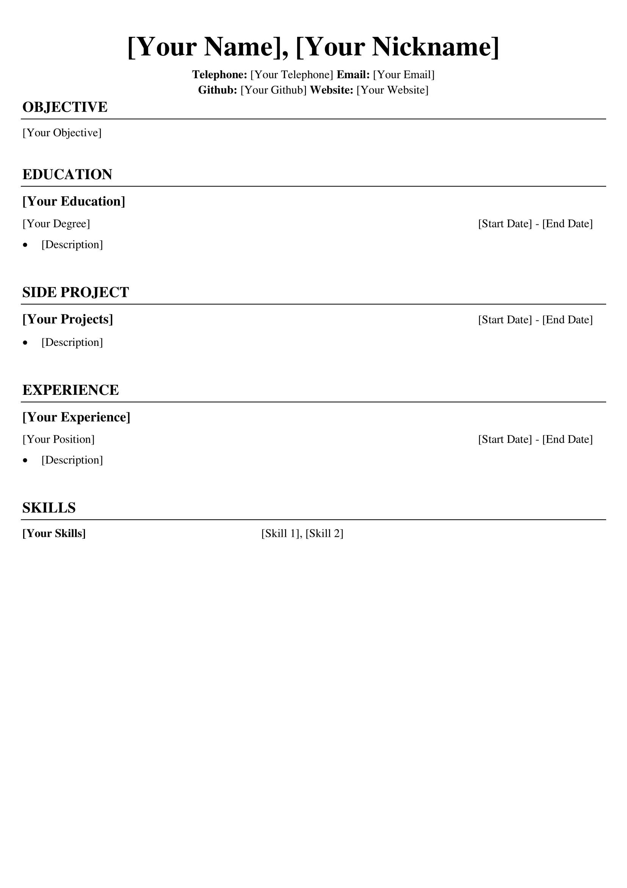

<p align="center">
  
</p>
  
## 🔥 Formal Resume Generator
This Formal Resume Generator is aim to generate a common layout but formal resume, since a lot of online template is too fancy and charging for some templates, therefore i built my own. 🙂

# Navigation

* [Disclaimer](#disclaimer)
* [Template & Samples](#template)
* [Templates](#features)
* [How to Write Better Resume](#better_resume)
* [What to write in each Components?](#write_in_component)
* [Instruction](#instruction)
* [Requirements](#requirement)
* [Run Locally](#run_locally)
* [Tech](#tech)
* [References](#reference)
* [License](#license)
* [Feedback](#feedback)

<a name='disclaimer'></a>
## ‼️ Disclaimer

*All the data will be stored locally only\
`NO DATA WILL PASS TO ANYBODY ELSE`

<a name='template'></a>
## 📃Template & Samples
<div align="center">
  
  
</div>

<a name='features'></a>
## ✨Features

- Definitely Formal, no fancy stuff, just black and write
- Provide word document for further adjustment
- Easy to Use
- Free, no charge

<a name='better_resume'></a>
## How to Write Better Resume
pass

<a name='write_in_component'></a>
## What to write in each Components
pass

<a name='instruction'></a>
## Instruction
pass

<a name='requirement'></a>
## Requirement

- python 3.9 or above
- pip 23.1.2

<a name='run_locally'></a>
## Run Locally
1. Clone the project to your repository
```sh
git clone https://github.com/Argonaut790/resume-generator.git
```
2. Change to project directory
```sh
cd .\resume-generator
```
3. Install package and dependencies
```sh
pip install -r requirements.txt
```
4. Execute the resume.py
```sh
python resume.py
```

<a name='tech'></a>
## Tech
- Used PySimpleGUI as the GUI for input
- Used python-docx to generate the word document

<a name='reference'></a>
## Useful Reference Link
- Scroll Bar Update in GUI\
https://stackoverflow.com/questions/65811804/how-to-automatically-update-the-pysimplegui-column-scroll-bar
- Dynamic Column in GUI\
https://github.com/amithr/PySimpleGUI-Dynamically-Add-Elements/blob/main/main.py

<a name='license'></a>
## License

[MIT license](./LICENSE)

<a name='feedback'></a>
## Feedback

if you found any bugs or any advices, please feel free to contact me via tung23966373@gmail.com
with title [resume-generator] ...
